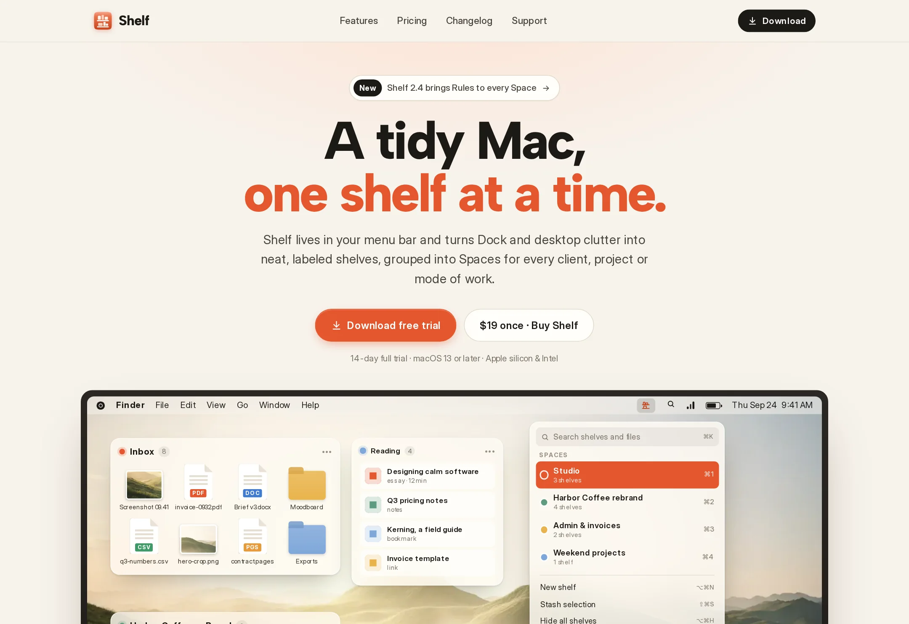

# Shelf

Menu-bar shelves and Spaces for a tidy Mac: the product site and the native macOS app.

**Live demo:** https://www.freelancerportfoliohub.com/jameslee/projects/shelfapp/index.html



## Overview

Shelf is a small, native macOS utility that lives in the menu bar. It sorts the files, folders, apps and links you
juggle into floating **shelves**, groups them into **Spaces** for each client, project or mode of work, and uses
**Rules** to file new downloads and screenshots automatically.

This repository contains both halves of the product:

- **`/` (Next.js):** the product site with features, pricing, changelog and support. The macOS surfaces on it (menu
  bar, Spaces popover, glass shelves, Dock and the Settings window) are HTML/CSS components sized in `em`, so the whole
  desktop mock scales from a wide monitor down to a phone and changes along with the UI. The site also serves the
  Sparkle update feed and the license endpoints the app calls.
- **`macos/` (Swift):** the SwiftUI menu-bar app. It has a `MenuBarExtra`, the shelf panels, the Rules engine and
  settings, and a store that persists the layout to a single local file.

## Features

**Site**

- Home, Features, Pricing, Changelog and Support pages, with all copy and product data typed in `lib/data`
- An em-based macOS desktop mock (`components/mac`) that scales with container-query units
- A changelog written as typed release entries with New, Improved and Fixed tags. The same data feeds
  `/appcast.xml` for Sparkle
- `/api/checkout` hands off to hosted checkout for each license, with a 5-seat minimum on Team
- `/api/license/activate` handles activation and deactivation per Mac, with machine IDs hashed before storage
- `/api/license/recover` resends keys by email and never reveals whether an address has a license
- Native `<details>` for the FAQs and mobile menu, focus styles, and reduced-motion support

**App**

- `MenuBarExtra` popover with search, Spaces on ⌘1–9, New shelf, Stash selection, Hide all and undo of the last
  automatic move
- Non-activating floating panels for each shelf in the active Space, which accept dragged files and links
- A pure, testable `RuleEngine`: match by source folder, extension, name, screenshot or age. Rules scoped to a Space
  take priority over global rules
- `ShelfStore` (`ObservableObject`) persists to JSON in Application Support and imports/exports `.shelfspace` files
- `DockService` puts `NSWorkspace` and Accessibility calls behind a protocol and keeps a Dock stack folder in sync with
  the active Space
- XCTest coverage for the rule engine, the store and layout encoding

## Tech stack

| Area | Stack                                                                  |
| ---- | ---------------------------------------------------------------------- |
| Site | Next.js 15 (App Router), React 19, TypeScript (strict), zod, plain CSS |
| App  | Swift 5.9, SwiftUI + AppKit, Combine, Sparkle 2, XCTest (macOS 13+)     |

## Getting started

### Site

```bash
pnpm install
cp .env.example .env.local
pnpm dev            # http://localhost:3000
```

| Variable                        | Description                                                  |
| ------------------------------- | ------------------------------------------------------------ |
| `NEXT_PUBLIC_SITE_URL`          | Canonical URL for metadata and appcast links                 |
| `NEXT_PUBLIC_DOWNLOAD_BASE_URL` | Host for signed `Shelf-<version>.dmg` builds                 |
| `CHECKOUT_URL_PERSONAL` / `_FAMILY` / `_TEAM` | Hosted checkout links per license              |
| `MAIL_API_URL`, `MAIL_API_KEY`  | Transactional email for key recovery (logs to console if unset) |

### macOS app

```bash
cd macos
swift build
swift test
open Package.swift  # opens in Xcode to run and sign the app
```

## Project structure

```
.
├── app/                  Routes: /, /features, /pricing, /changelog, /support
│   ├── api/              checkout, license/activate, license/recover
│   └── appcast.xml/      Sparkle feed generated from the changelog
├── components/
│   ├── mac/              Desktop, MenuBar, ShelfCard, SpacesPopover, Dock, SettingsWindow…
│   ├── home/ features/ pricing/ changelog/ support/
│   ├── layout/           Header, Footer, DownloadCta
│   └── ui/               Button, Icon, TickList, FaqList, FeatureSplit…
├── lib/
│   ├── data/             Typed content: desktop mock, features, pricing, changelog, support
│   └── *.ts              release helpers, appcast builder, license service, mailer
├── styles/               tokens, base, layout, macos, pages, responsive
├── types/
├── public/               App icon, wallpaper
└── macos/
    ├── Package.swift
    ├── Sources/Shelf/    ShelfApp, Models, Store, Services, Views, Support
    └── Tests/ShelfTests/
```

## Scripts

| Script           | Description                          |
| ---------------- | ------------------------------------ |
| `pnpm dev`       | Start the dev server with Turbopack  |
| `pnpm build`     | Production build                     |
| `pnpm start`     | Serve the production build           |
| `pnpm lint`      | Lint with ESLint                     |
| `pnpm typecheck` | Type-check with `tsc --noEmit`       |
| `pnpm format`    | Format with Prettier                 |
| `swift test`     | Run the macOS app's tests (`macos/`) |
