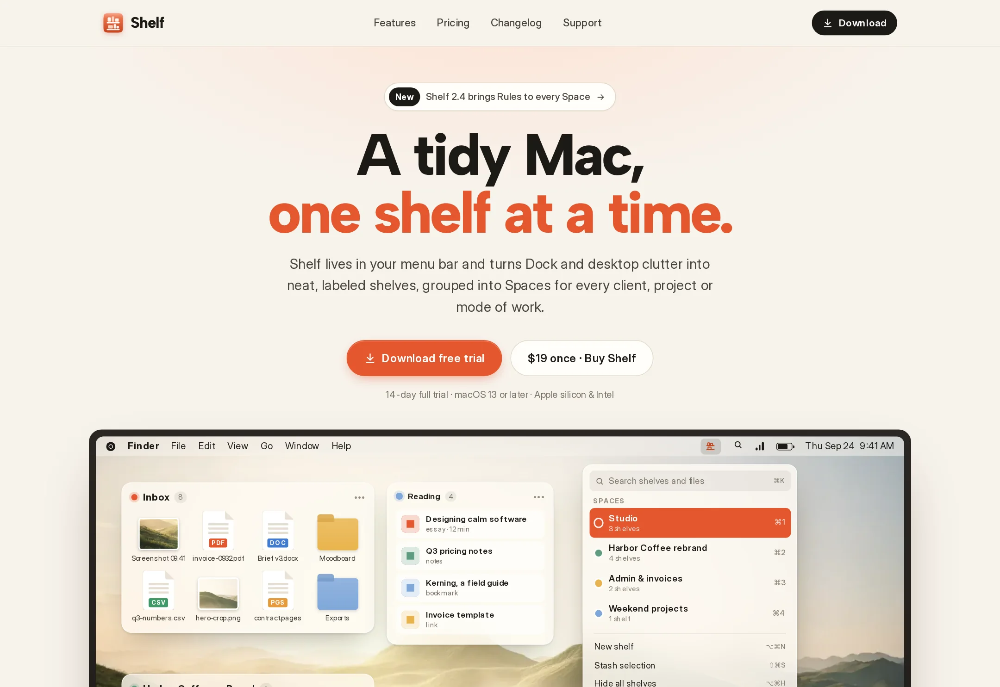

# Shelf

Menu-bar shelves and Spaces for a tidy Mac: the native macOS app and the product site, all in Swift.

**Live demo:** https://www.freelancerportfoliohub.com/jameslee/projects/shelfapp/index.html



## Overview

Shelf is a small, native macOS utility that lives in the menu bar. It sorts the files, folders, apps and links you
juggle into floating **shelves**, groups them into **Spaces** for each client, project or mode of work, and uses
**Rules** to file new downloads and screenshots automatically.

This repository contains every part of the product:

- **`ShelfKit/` (Swift package):** the core of the app with no AppKit in it. It holds the Spaces and shelves model, the
  Rules engine, layout persistence and migration, drag-and-drop planning, the Dock stack and folder-change logic, and
  the licensing types the app and the site share. It builds and tests on macOS and Linux.
- **`macos/` (SwiftUI + AppKit):** the menu-bar app. It has a `MenuBarExtra`, the floating shelf panels, Settings and
  Sparkle updates, all built on ShelfKit.
- **`server/` (Swift, Hummingbird):** serves the product site, the changelog and the Sparkle appcast, and the
  checkout and license endpoints the app calls.
- **`site/` (HTML/CSS):** the product site's pages and styles. The macOS surfaces on it (menu bar, Spaces popover,
  glass shelves, Dock and the Settings window) are plain HTML/CSS sized in `em`, so the whole desktop mock scales from a
  wide monitor down to a phone.

## Features

**App**

- `MenuBarExtra` popover with search, Spaces on ⌘1–9, New shelf, Stash selection, Hide all and undo of the last
  automatic move
- Non-activating floating panels for each shelf in the active Space, pinned to an edge or floating, with sort orders
- Drag and drop: files, folders, apps, links and `.webloc` bookmarks drop in at the pointer's position. A tile dragged
  to another shelf in the Space moves (⌥ copies). Unsafe link schemes are refused
- A pure, testable `RuleEngine`: match by source folder, extension, name, screenshot or age. Rules scoped to a Space
  take priority over global rules. "Any shelf" rules archive items that haven't been used in a while
- Rule previews, and undo of the last automatic move for ten minutes
- The layout persists to one JSON file in Application Support, keeping a backup of the previous save, and older
  formats migrate on load. Layouts export to `.shelfspace` files without bookmarks or usage dates, and import either
  as a replacement or as extra Spaces from a template
- A Dock stack folder that mirrors the active Space and is updated link by link
- License activation, deactivation and key recovery against the site's API, using a hashed hardware ID

**Site and server**

- Home, Features, Pricing, Changelog and Support pages as HTML templates with shared header, footer and download
  partials
- Version, download link, file size and prices come from Swift, so the pages, the changelog and `/appcast.xml` read
  from the same release list
- `/api/checkout` hands off to hosted checkout for each license, with a 5-seat minimum on Team
- `/api/license/activate` handles activation and deactivation per Mac. Machine IDs are hashed before storage, and
  activations are serialised so two Macs can't both take the last seat
- `/api/license/recover` resends keys by email and never reveals whether an address has a license
- Native `<details>` for the FAQs and mobile menu, focus styles, and reduced-motion support

## Tech stack

| Area     | Stack                                                                               |
| -------- | ----------------------------------------------------------------------------------- |
| Core     | Swift 5.9+, Foundation only (macOS 13+ and Linux), XCTest                           |
| App      | SwiftUI + AppKit, Combine, Sparkle 2, ServiceManagement, XCTest (macOS 13+)         |
| Server   | Swift 6.4 toolchain, Hummingbird 2, swift-crypto, swift-log, XCTest + HummingbirdTesting |
| Site     | Hand-written HTML templates and plain CSS, no JavaScript                            |
| Hosting  | Docker (multi-stage, Swift slim runtime image), Railway                             |

## Getting started

### Core package

```bash
cd ShelfKit
swift build
swift test          # runs on macOS and Linux
```

### macOS app

Needs macOS 13+ and Xcode 15 or later.

```bash
cd macos
swift build
swift test
open Package.swift  # opens in Xcode to run and sign the app
```

The app target uses AppKit and SwiftUI, so it only builds on macOS. Everything it relies on in ShelfKit is covered by
the ShelfKit tests on any platform.

### Site server

Needs the Swift 6.4 toolchain (Hummingbird's dependencies require it). Run from the repository root so the server can
find `site/`:

```bash
swift build --package-path server
SITE_ROOT=site PORT=8080 swift run --package-path server ShelfServer   # http://localhost:8080
swift test --package-path server
```

On Linux the test target links zlib, so install `zlib1g-dev` (Debian/Ubuntu) if the linker can't find `-lz`.

The server starts with one demo license (`SHELF-7F3A2C9E-41B8-4D`, priya@example.com) so activation can be tried end
to end, and logs recovery emails instead of sending them until mail is configured.

| Variable                                      | Description                                                        |
| --------------------------------------------- | ------------------------------------------------------------------ |
| `PORT`                                        | Port to listen on (8080 when unset). Railway sets it               |
| `SITE_URL`                                    | Canonical URL for metadata and appcast links                       |
| `DOWNLOAD_BASE_URL`                           | Host for signed `Shelf-<version>.dmg` builds                       |
| `CHECKOUT_URL_PERSONAL` / `_FAMILY` / `_TEAM` | Hosted checkout links per license                                  |
| `MAIL_API_URL`, `MAIL_API_KEY`                | Transactional email for key recovery (logged if unset)             |
| `SITE_ROOT`                                   | Folder with `templates/` and `public/` (`site`; `/app/site` in Docker) |
| `LOG_LEVEL`                                   | `info` by default                                                  |

### Docker and Railway

```bash
docker build -t shelf-site .
docker run --rm -p 8080:8080 shelf-site
```

The `Dockerfile` builds `server/` with ShelfKit and copies `site/` into the image. It listens on `$PORT`, and
`railway.json` points Railway at the Dockerfile with `/health` as the health check.

## Project structure

```
.
├── ShelfKit/                 Swift package, builds on macOS and Linux
│   ├── Sources/ShelfKit/
│   │   ├── Models/           Space, Shelf, ShelfItem, Rule, ShelfLayout (format versions)
│   │   ├── Rules/            RuleEngine, FileCandidate, inspectors
│   │   ├── Library/          ShelfLibrary (every layout change), LibraryCoordinator (save + sync)
│   │   ├── DragDrop/         DropPayload, DropPlanner, ShelfGridMetrics
│   │   ├── Persistence/      File and in-memory persistence, LayoutCoder
│   │   ├── System/           FolderChangeDetector, DockStackPlan / DockStackFolder
│   │   ├── Licensing/        LicenseKey, AppVersion, activation and recovery wire types
│   │   └── Support/          HexColor
│   └── Tests/ShelfKitTests/
├── macos/                    The menu-bar app
│   ├── Sources/Shelf/        ShelfApp, Store, Services (Dock, folders, Spotlight, Sparkle, license), Views
│   └── Tests/ShelfTests/
├── server/                   Hummingbird server
│   ├── Sources/ShelfWeb/     Routes, Releases, Appcast, LicenseService, Checkout, Mailer, Site/ (templates, icons)
│   ├── Sources/ShelfServer/  Entry point
│   └── Tests/ShelfWebTests/
├── site/
│   ├── templates/            layout.html, partials/ (header, footer, download), pages/
│   └── public/               css/, fonts/, app icon, wallpaper
├── Dockerfile
└── railway.json
```

## Scripts

| Command                                | Description                                  |
| -------------------------------------- | -------------------------------------------- |
| `swift test --package-path ShelfKit`   | Test the core package (macOS or Linux)       |
| `swift test --package-path macos`      | Test the app's store layer (macOS)           |
| `swift test --package-path server`     | Test routes, templates, appcast and licenses |
| `swift run --package-path server ShelfServer` | Run the site locally (set `SITE_ROOT=site`) |
| `docker build -t shelf-site .`         | Build the deployable image                   |
